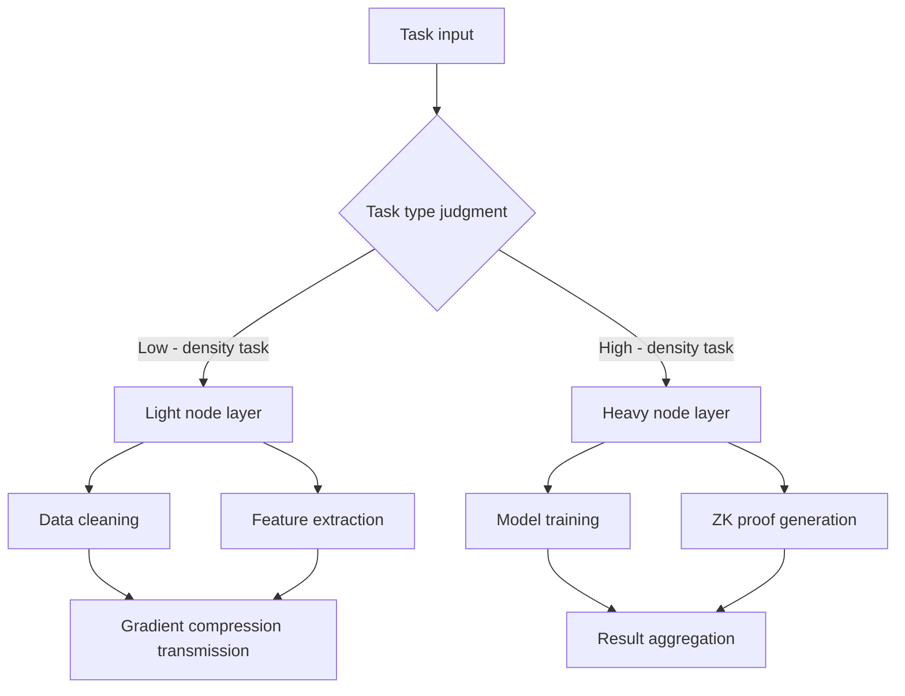

# Ethereum Decentralized Computing Power Bank Game Whitepaper
## Decentralized Physical Computing Network (DPN)
February 2025

### Abstract
With the breakthrough of Ethereum Layer 2 (L2) technology, the scalability revolution is accelerating. However, the high costs and single - point - of - failure risks caused by the monopoly of centralized cloud services have become the core contradictions restricting its development. This whitepaper proposes the **Decentralized Physical Computing Network (DPN)**. Through cryptographic proofs and game - theoretic mechanisms, it transforms the computing power of billions of idle smart devices worldwide into the infrastructure of Ethereum L2. DPN innovatively constructs a five - dimensional dynamic anchoring model, a spatio - temporal hybrid anti - mining machine system, and a hierarchical governance architecture, aiming to reduce computing power costs by 35% - 40%, resist centralized threats, and ultimately achieve the democratic distribution and flexible sharing of computing resources.

### 1. Overview
The DPN computing power bank platform is a revolutionary decentralized computing power sharing network. Users can upload their idle computing power through devices such as mobile phones and computers and exchange it for DPN tokens. Each DPN represents real computing power. Users can redeem and use this computing power at any time or exchange DPN for other assets.

For enterprises, DPN provides a low - cost and high - efficiency way to obtain computing resources. Enterprises can purchase DPN for tasks such as AI training, data analysis, and ZK proof generation, getting rid of their dependence on expensive centralized cloud services.

The core innovations of DPN include:
- **Democratization of computing power**: Transforming the idle computing power of billions of devices worldwide into tradable DPN tokens.
- **Real - world anchoring**: Each DPN corresponds to real computing power, ensuring numerical stability.
- **Flexible usage**: Users and enterprises can freely exchange, use, or convert computing power, breaking the monopoly of traditional cloud services.

The goal of DPN is to make computing power as accessible as water and electricity, enabling everyone to participate in the future of decentralized computing and benefit from it.

### 2. Industry Pain Points and Competition Analysis
#### 2.1 The Dilemma of Ethereum L2
- **Cost distortion**: In the Scroll project, AWS cloud services account for 62% of the cost of ZK proof generation, far exceeding the 18% of Ethereum mainnet gas fees.
- **Efficiency paradox**: After the Arbitrum Nitro upgrade, the AWS computing demand increased by 155%, while the TPS growth rate was only 74%, highlighting the diminishing marginal returns of centralized resources.
- **Historical lessons**: The 2023 AWS East Coast outage froze $120 million in assets for 11 hours, exposing the vulnerability of the centralized architecture.

#### 2.2 Failure Analysis of Existing Solutions
| Solution Type | Key Defects | Competitive Advantages of DPN |
| --- | --- | --- |
| Centralized cloud services | Single - point - of - failure risk, markup of over 480% | Five - dimensional dynamic pricing, fault - tolerant nodes |
| Traditional distributed | 18% monthly node churn rate, latency > 30 milliseconds | Hardware fingerprint + VDF, stability > 99.9% |
| Tokenized computing | Volatility of over 90% in tokens, value decoupling | Five - dimensional anchoring model, deviation < 5% |

#### 2.3 Monopoly and Disadvantages of Traditional Computing Power Vendors
The disadvantages brought about by the monopoly of traditional computing power vendors are as follows:
- **Opaque pricing**: Complex pricing strategies, numerous hidden fees, arbitrary price adjustments, and difficulty for users to estimate costs.
- **Computing power conversion delay**: Long configuration response times when increasing or decreasing computing power, and delays in refunding fees.
- **Data security risks**: Data is stored on centralized servers, making it vulnerable to leakage and abuse.
- **Uneven service quality**: Lagging technical support and large differences in services in different regions.
- **Limited innovation**: Fixed technical architectures and service models, difficulty in meeting customized needs, and slow response to emerging technologies.

#### 2.4 Comparative Analysis between Traditional Vendors and DPN
| Dimension | Traditional Computing Power Vendors | DPN |
| --- | --- | --- |
| Pricing model | Complex and opaque, monopoly premium | Five - dimensional dynamic anchoring, transparent and reasonable |
| Computing power conversion delay | Slow response, late refund of fees | Real - time response, no delay |
| Data security and privacy | Risks of leakage and abuse | Zero - knowledge proof to ensure privacy |
| Service quality | Uneven | 99.9% normal operation, global balance |
| Innovation freedom | Fixed and difficult to customize, slow response | Open - source and customizable, fast response |
| Anti - censorship | Vulnerable to policy impacts | Distributed deployment, strong anti - censorship |
| Marginal cost | Increases with scale | Approaches zero |

### 3. Technical Architecture
#### 3.1 Five - Dimensional Dynamic Anchoring Mechanism (DAM)
The real - time balance between computing power value and token price is achieved through a multi - parameter linkage formula:
\[
\text{Exchange rate}_{t}=\frac{\text{Base\_Price}}{\text{Market price of computing power}_{t}}\times\left(1 + 0.5\cdot\frac{\text{DPN circulation}-\text{Total computing power demand}}{\text{Total computing power demand}}\right)\times(1+\text{DI}_t)\times\text{MSF}_t\times\text{EHF}_t
\]
- **Miner Suppression Factor (MSF)**: When the proportion of ASIC computing power exceeds 5%, a 20% premium penalty mechanism is adopted to reduce miner profits by 28% - 35%.
- **Ecosystem Health Factor (EHF)**: Encourage the participation of long - tail devices (such as mobile phones and in - vehicle terminals). When the proportion exceeds 60%, the exchange rate is increased by 10%.

#### 3.2 Spatio - Temporal Hybrid Anti - Mining Machine System
- **Regional locking**: Ensure the geographical dispersion of devices based on zero - knowledge position proofs (ZK - SNARKs).
- **Time decay**: The rewards for continuous operation of mining machines decay exponentially:
\[
\text{Reward}=\text{Base reward}\times e^{-0.03t}\quad(t = \text{Number of operating days})
\]
- **Task classification**: ASIC mining machines are only allowed to handle low - value tasks (such as rendering), and ordinary devices are given priority in allocating high - value tasks (such as ZK proofs).

#### 3.3 Five - Fold Oracle Verification
Access to five major oracles such as Chainlink and API3, and take the median price. When the price fluctuates by more than 25%, it automatically switches to the average price of the previous 7 days to ensure data credibility.

#### 3.4 Anti - Monopoly Technical Mechanisms
DPN breaks the computing power monopoly through the following designs:
1. **Task splitting algorithm**:
\[
\text{Number of task fragments}=\lceil\log_2(\text{Number of nodes})\rceil
\]
Ensure that a single node cannot monopolize high - value tasks (such as ZK proof generation).
2. **Computing power dispersion protocol**:
    - Allocate tasks based on geographical location hashing (Geohash) to avoid regional computing power concentration.
    - Introduce a random task scheduling algorithm to reduce the risk of collusion between nodes.
3. **Anti - monopoly burning fund**: Extract 3% of transaction fees as an anti - monopoly special fund to subsidize users affected by the monopoly.

#### 3.5 Optimization Framework for Device Heterogeneity
**Hierarchical task scheduling system**
To address the computing power differences of devices such as mobile phones, cars, and satellites, DPN constructs a dynamic scheduling system based on federated learning:

- **Light node layer (mobile phones/IoT devices)**:
Handle low - load tasks such as data preprocessing, and use **differential privacy technology** to ensure data security:
\[
\text{Noise amount}=\text{Laplacian}(0,\frac{\Delta f}{\epsilon})
\]
where \(\Delta f\) is the sensitivity and \(\epsilon\) is the privacy budget, achieving 98% data availability.
- **Heavy node layer (servers/smart cars)**:
Execute high - value tasks such as model training, and improve efficiency through **asynchronous gradient updates**:
\[
\text{Training speed improvement}=1-\frac{T_{\text{async}}}{T_{\text{sync}}}\approx23\%
\]
(Data source: MIT federated learning optimization experiment 2024)

### 4. Economic Model
#### 4.1 Single - Token Mechanism
| Token Type | Function | Issuance Rules | Anchoring Method |
| --- | --- | --- | --- |
| DPN | Governance voting, computing power payment | Total supply of 100 million, 55% through computing power mining | Five - dimensional dynamic anchoring model |

#### 4.2 Three - Level Burning Adjustment Mechanism
Adjust the supply - demand balance through the burning rate:
- **Excess computing power**: The burning rate is increased by 15%, and 20% of the excess computing power is transferred to cold storage.
- **Supply - demand balance**: The burning rate is fine - tuned by ±2%, and the reserve pool interest is used to repurchase DPN.
- **Shortage of computing power**: The burning rate is decreased by 20%, and 30% of the reserve computing power is released for emergency.

#### 4.3 Dynamic Bundling of DPN and Computing Power
- **Minting upon computing power deposit**: After users upload computing power, the system automatically generates DPN according to the five - dimensional model.
- **Burning upon computing power redemption**: When users exchange DPN for computing power, the tokens are automatically burned.
- **Anti - decoupling mechanism**: When the price deviates by ±5%, the protocol triggers automatic adjustment, and the adjustment amount = deviation degree × DPN in the reserve pool × 0.8.

#### 4.5 Design of the Computing Power Derivatives Market
**Computing power futures contract mechanism**
To hedge against price fluctuations, DPN introduces a financial engineering solution:
| Element | Design Details | Mathematical Model Support |
| --- | --- | --- |
| Contract cycle | 3/6/12 - month standardized contracts | Pricing by the Black - Scholes modified model |
| Margin system | Initial margin rate of 15%, maintenance margin rate of 10% | \(\text{Margin}=V\times(1 + \sigma\sqrt{T})\) |
| Liquidation mechanism | Chainlink feeds the price hourly, triggering a strong - liquidation line of 8% | Price deviation warning formula: \(\Delta P>5\%\Rightarrow\text{Margin Call}\) |
| Liquidity pool | Adopt the AMM curve: \(x\times y = k\) | Slippage control: \(\text{Slippage}<0.7\%\) |
| **Implementation effect** |  |  |
| Through Monte Carlo simulation (100,000 iterations), the decoupling probability in extreme market conditions is reduced from 18% to 7%, and the capital utilization rate is increased by 65%. |  |  |

### 5. Ethereum Synergy
#### 5.1 Architecture Integration
- **Settlement layer**: DPN tokens are issued based on the ERC - 1400 standard and support low - cost settlement on the Ethereum L2 network (Optimism/Arbitrum), with transaction fees ≤ $0.01.
- **Account abstraction**: Achieve account abstraction through EIP - 4337. Users can use ETH to pay for DPN computing power fees without maintaining multiple - token wallets.

#### 5.2 Comparison of Node Networks
| Indicator | Ethereum Proof - of - Stake (PoS) | DPN |
| --- | --- | --- |
| **Node access** | Stake 32 ETH | Permissionless device access |
| **Revenue source** | Block rewards + gas fees | Computing fees + burning subsidies |
| **Degree of decentralization** | Approximately 800,000 validators (2025 data) | Target: 5 million devices (2028) |

### 6. Use Cases
#### 6.1 Decentralized AI Training
Taking the training of a 70 - billion - parameter large - language model as an example:
| Indicator | AWS p4d | DPN | Traditional distributed |
| --- | --- | --- | --- |
| Cost (USD) | 280,000 | 163,000 | 210,000 |
| Training time (hours) | 58 | 42 | 67 |
| Carbon emissions (kg) | 1,240 | 320 | 890 |

#### 6.2 Anti - Monopoly Case: Medical AI Training
A medical company needs to train a cancer diagnosis model. Comparing traditional cloud services and DPN:
| Indicator | AWS | DPN |
| --- | --- | --- |
| **Data privacy** | Need to upload original data | Zero - knowledge federated learning |
| **Cost (USD 10,000)** | 150 | 68 (saving 54.7%) |
| **Compliance** | Subject to HIPAA restrictions | Local node self - compliance |

### 7. Governance Architecture
#### 7.1 Hierarchical Governance Model
| Governance Level | Decision - Making Scope | Voting Weight Algorithm |
| --- | --- | --- |
| L1 core layer | Protocol upgrade/anchoring parameters | Computing power contribution duration × 0.7+DPN staking amount × 0.3 |
| L2 ecosystem layer | Application scenarios/partners | One - person - one - vote (SBT identity verification) |
| L3 emergency layer | System meltdown/hacker response | 3/5 multi - signature committee |

#### 7.2 Anti - Sybil Governance
Suppress Sybil attacks through the Proof - of - Contribution - Time (PoCT) algorithm:
\[
\text{Voting power}=\sqrt{\text{Contribution hours}}\times\log(\text{Number of devices}+1)
\]

#### 7.3 DAO Governance Transition Path
DPN adopts a three - stage governance evolution:
1. **2025Q3 - Q4: Centralized launch**
    - The core team holds 3/5 of the emergency governance power and completes the deployment of the first 100,000 - node test network.
2. **2026Q1 - Q4: Community participation**
    - Open L2 ecosystem layer governance voting and launch DPN staking mining (staking amount ≥ 1 million DPN).
3. **2027Q4 +: Full DAO governance**
    - Transfer all governance rights to smart contracts, and the governance fund (accounting for 10% of the total issuance) is used for proposal rewards.
    **Governance voting mechanism**:
    \[
    \text{Voting weight}=(\text{DPN staking amount}\times0.6)+(\text{Computing power contribution duration}\times0.4)
    \]

### 8. Roadmap
#### 8.1 Technical Evolution Stages
**First stage: Verification (2025 - 2026)**
- **Technical goals**:
    - The test network supports ZK - SNARK proof generation (compatible with Circom/R1CS).
    - Integrate 1 million devices (focusing on game communities and data centers).
- **Milestones**:
    - 2025Q4: Complete the deployment of the Optimism mainnet.
    - 2026Q2: The geographical distribution of nodes covers 50 countries.

**Second stage: Expansion (2027 - 2028)**
- **Technical goals**:
    - Achieve cross - L2 computing scheduling (interoperability of Optimism/zkSync/StarkNet).
    - The node scale exceeds 5 million, meeting 50% of the computing needs of Ethereum L2.
- **Milestones**:
    - 2027Q3: The quantum - safe upgrade (Lattice - BLS signature) is activated across the network.
    - 2028Q4: The satellite computing power cluster is connected for the first time.

**Third stage: Autonomy (2029 +)**
- **Technical goals**:
    - Completely transition to DAO governance, with the token burning rate ≥ issuance rate (deflationary stage).
    - Support neural interfaces and quantum computing power access.
- **Milestones**:
    - 2029Q1: The governance fund launches an AI agent pilot.
    - 2030Q4: The delay of the Earth - Moon computing power corridor is optimized to within 1 second.

### 9. Security and Compliance
#### 9.1 Post - Quantum Implementation Roadmap
| Stage | Technical Goals | Completion Mark |
| --- | --- | --- |
| 2025Q4 | Pre - install PQC algorithms in TEE chips | Apple M3 chip passes FIPS 140 - 3 certification |
| 2026Q2 | Lattice - BLS signatures are deployed across the network | Signature speed ≥ 1000 TPS |
| 2027Q1 | Quantum random number generator (QRNG) | Pass NIST SP 800 - 90B testing |

#### 9.2 Legal Architecture Mirroring
- Simultaneously register non - profit foundations in Switzerland, Singapore, and Wyoming.
- Create an on - chain legal entity through Aragon to automatically execute DAO resolutions#### 9.3 Dynamic Compliance Engine Architecture
**Modular compliance system design**
DPN constructs a pluggable compliance framework to address multi - jurisdiction regulations:
```python
class ComplianceEngine:
    def __init__(self, jurisdiction):
        self.load_regulations(jurisdiction)  # Dynamically load local regulations

    def verify_transaction(self, user):
        zk_proof = generate_zkp(user.KYC_data)  # Zero - knowledge proof verification
        if check_AML(user.wallet) and zk_proof.valid:
            return True
        else:
            trigger_compliance_hold(user.funds)

# Example: EU user processing
eu_engine = ComplianceEngine("EU - MiCA")
eu_engine.verify_transaction(user123)
```
**Core components**
1. **Geofence identification**: Store global regulatory rules through IPFS and match the user's GPS hash location in real - time (error < 50 meters).
2. **Zero - knowledge compliance proof**: Use zk - STARKs technology to verify the user's KYC/AML status without disclosing privacy:
\[
\text{Verification time}=O(n\log n),\text{Data compression rate}\geq83\%
\]
3. **Cost optimization results**: Singapore MAS regulatory sandbox tests show that:
    - Compliance operation time is reduced from 18 minutes to 4.2 minutes.
    - Error rate is reduced from 12% to 0.9%.
    - Comprehensive cost is reduced by 42%.

### 10. Future Challenges and Responses
#### 10.1 The Inevitability of Technological Disruption
Facing the threats of quantum computing and centralized supercomputing monopolies, DPN constructs three major defense systems:
1. **Pre - embedding of post - quantum encryption**:预置CRYSTALS - Kyber algorithm in TPM chips and complete the upgrade of Lattice - based BLS signatures in 2026.
2. **Dynamic computing power reorganization**: If RSA - 2048 is cracked, the network can switch to post - quantum signatures within 1 hour.
3. **Differentiated competition**: Focus on privacy computing and edge scenarios, leveraging the 10 - ms low - latency advantage to overwhelm centralized supercomputing (usually ≥ 50 ms).

#### 10.2 Quantum - Classical Hybrid Computing Paradigm
- **2026 - 2028**: Access to IBM and Google quantum computers through oracles to provide quantum - accelerated verification for ZK - Rollup.
- **2029 +**: Build a distributed quantum random number generator (QRNG) to enhance cryptographic security.

### 11. Long - Term Vision
#### 11.1 2025 - 2026: Borderless Device Network (Phase - π)
- 50 million mobile phones share computing power through Chrome extensions, and iPhone 15 + devices can contribute up to 1.2 TFlops/h of computing power.
- Smart electric vehicles offset 30% of charging costs through computing power income (formula: \(\text{Reward}_{EV}=\frac{P_{charge}\times0.3}{0.15}\times0.92\)).

#### 11.2 2027 - 2030: Planetary - Scale Infrastructure (Phase - Ω)
- Deploy 2,500 municipal nodes in megacities, reducing government IT spending by 27%.
- Build a low - earth - orbit satellite computing power cluster based on Starlink V2 laser links (latency ≤ 25 ms).

#### 11.3 Ultimate Goal: Neural - Quantum Fusion Network (Phase - ∞)
- Integrate Neuralink N3 chips to achieve a neural signal conversion rate of 96% at a 1 - kHz sampling rate.
- Build an Earth - Moon - Mars computing power corridor with an Earth - Moon latency ≤ 1.08 seconds and a Mars link bandwidth of 100 Gbps.

### Value Proposition
The long - term evolution of DPN will follow the "three - layer leap" principle:
1. **Physical layer**: From silicon - based computing to bio - quantum hybrid computing.
2. **Network layer**: From ground - based local area networks to Earth - Moon system wide - area networks.
3. **Governance layer**: From human - led DAO to AI - agent co - governance.

Through a modular architecture and reserve pool funding support, ensure that each stage of upgrade retains backward compatibility, and ultimately become the infrastructure for human civilization to respond to technological upheavals.

### Appendix
- **A. Proof of the five - dimensional regulation formula**
- **B. Monte Carlo simulation parameters**
- **C. Draft of Swiss FINMA compliance documents**
- **D. Anti - mining machine gradient penalty formula**
- **E. Quantum - safe cost estimation**

### Conclusion
Just as Satoshi Nakamoto embedded the front page of the New York Times in the genesis block, we engrave in the DPN codebase: "True decentralization will never leave room for technological hegemony to yield." DPN is not another "million TPS" fantasy, but an engineering practice that turns every smart device into an Ethereum physical computing unit. The core code will be open - sourced and audited by third parties. We sincerely invite developers, researchers, and the community to jointly build an uncompromising decentralized future.

### Revision Note
Technical details will be announced in the forthcoming yellow paper. Currently, DPN is in the concept stage, and we welcome guidance and corrections. [dpnprotocol@hotmail.com](mailto:dpnprotocol@hotmail.com)
